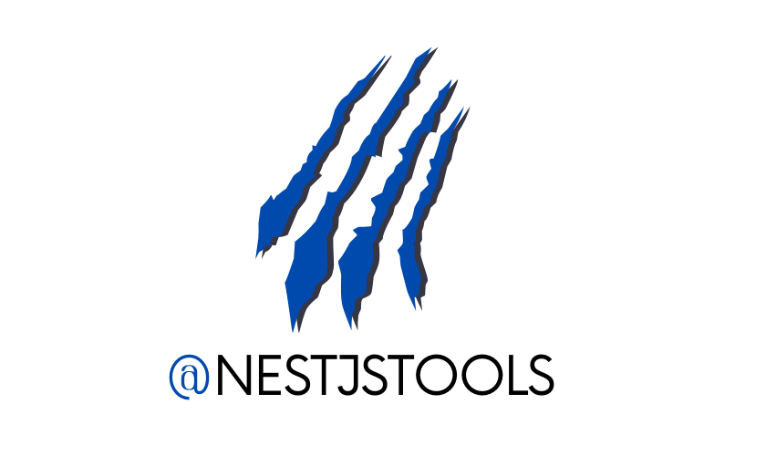

<p align="center">
    
</p>

# NestJS Messaging Library – Message Bus & Service Bus for Distributed Systems

A powerful **message bus and service bus library for NestJS** designed for building **scalable, event-driven and distributed systems**.

NestJSTools Messaging provides a **broker-independent messaging abstraction** that allows applications to communicate through **commands, events and queries** using a flexible **message bus architecture**.

The framework integrates seamlessly with the **NestJS dependency injection system**, decorators and modules, making it easy to build **CQRS architectures, microservices and event-driven applications**.

It supports multiple messaging transports including **RabbitMQ, Redis, NATS, Amazon SQS, Google Pub/Sub and Azure Service Bus**, allowing developers to switch brokers without rewriting application logic.

This repository contains the **core messaging framework** and **official transport extensions** for integrating different messaging infrastructures.


---

## Features of NestJSTools Messaging

NestJSTools Messaging helps you build **scalable, event-driven and distributed systems in NestJS** without coupling your application to a specific messaging broker.

Key capabilities include:

- **Message Bus architecture** (Commands, Events, Queries)
- **Broker-independent messaging** – easily switch transports
- **Multiple handlers per message**
- **Channel abstraction layer**
- **Middleware pipeline for message processing**
- **Custom message normalization (serialization / deserialization)**
- **Async consumers for background message processing**
- **Centralized exception handling**
- **Custom logging support**
- **High extensibility for building custom transports**

Supported transports include:

- RabbitMQ
- Redis
- NATS
- Amazon SQS
- Google Pub/Sub
- Azure Service Bus

---

## Packages

### Core

| Package                                                                          | Description              |
|----------------------------------------------------------------------------------|--------------------------|
| [`@nestjstools/messaging`](https://www.npmjs.com/package/@nestjstools/messaging) | Core messaging framework |

### Official Extensions

| Package                                                                                                                                  | Description               |
|------------------------------------------------------------------------------------------------------------------------------------------|---------------------------|
| [`@nestjstools/messaging-redis-extension`](https://www.npmjs.com/package/@nestjstools/messaging-redis-extension)                         | Redis channel adapter     |
| [`@nestjstools/messaging-rabbitmq-extension`](https://www.npmjs.com/package/@nestjstools/messaging-rabbitmq-extension)                   | RabbitMQ channel adapter  |
| [`@nestjstools/messaging-amazon-sqs-extension`](https://www.npmjs.com/package/@nestjstools/messaging-amazon-sqs-extension)               | Amazon SQS adapter        |
| [`@nestjstools/messaging-google-pubsub-extension`](https://www.npmjs.com/package/@nestjstools/messaging-google-pubsub-extension)         | Google Pub/Sub adapter    |
| [`@nestjstools/messaging-nats-extension`](https://www.npmjs.com/package/@nestjstools/messaging-nats-extension)                           | NATS adapter              |
| [`@nestjstools/messaging-azure-service-bus-extension`](https://www.npmjs.com/package/@nestjstools/messaging-azure-service-bus-extension) | Azure Service Bus adapter |

---

## Installation

Install the **core package**:

```bash
npm install @nestjstools/messaging
````

or

```bash
yarn add @nestjstools/messaging
```

Then install a **transport extension** if needed:

```bash
npm install @nestjstools/messaging-rabbitmq-extension
```

---

## Quick Example

Below is a minimal example showing how to:

* define a **message**
* create a **message handler**
* configure the **MessagingModule**
* **dispatch a message**

---

### 1️⃣ Define a Message

```ts
export class SendMessage {
  constructor(
    public readonly content: string,
  ) {
  }
}
```

### 2️⃣ Create a Message Handler

```ts
import { Injectable } from '@nestjs/common';
import {
  MessageHandler,
  IMessageHandler,
} from '@nestjstools/messaging';
import { SendMessage } from './send-message';

@Injectable()
@MessageHandler('chat.message')
export class SendMessageHandler implements IMessageHandler<SendMessage> {

  async handle(message: SendMessage): Promise<void> {
    console.log('Received message:', message.content);
  }

}
```

### 3️⃣ Configure the Messaging Module

```ts
import { Module } from '@nestjs/common';
import { MessagingModule, InMemoryChannelConfig } from '@nestjstools/messaging';
import { SendMessageHandler } from './send-message.handler';

@Module({
  imports: [
    MessagingModule.forRoot({
      buses: [
        {
          name: 'message.bus',
          channels: ['memory'],
        },
      ],
      channels: [
        new InMemoryChannelConfig({
          name: 'memory',
        }),
      ],
      debug: true,
    }),
  ],
  providers: [SendMessageHandler],
})
export class AppModule {
}
```

### 4️⃣ Dispatch a Message

Messages can be dispatched from **anywhere in your application**.

Example using a controller:

```ts
import { Controller, Get } from '@nestjs/common';
import { IMessageBus, MessageBus, RoutingMessage } from '@nestjstools/messaging';
import { SendMessage } from './send-message';

@Controller()
export class AppController {

  constructor(
    @MessageBus('message.bus')
    private readonly messageBus: IMessageBus,
  ) {
  }

  @Get()
  async send(): Promise<string> {

    await this.messageBus.dispatch(
      new RoutingMessage(
        new SendMessage('Hello from NestJSTools!'),
        'chat.message',
      ),
    );

    return 'Message dispatched!';
  }
}
```

---
## Architecture

### High level flow of message dispatching and handling:

```marmaid
flowchart LR

    M[Message]
    MB[Message Bus]
    C[(Channel)]
    MW[Middleware]
    H[Message Handler]

    M -->|dispatch| MB
    MB --> C
    C --> MW
    MW --> H
```

### Exception handling flow:

```marmaid
flowchart LR

    M[Message]
    MB[MessageBus]
    C[InMemoryChannel]
    MW[Middleware]
    H[MessageHandler]
    EL[ExceptionListener]

    M -->|dispatch| MB
    MB --> C
    C --> MW
    MW --> H

    H -. throws error .-> C
    MW -. throws error .-> C
    C -. notify .-> EL
```

---

## Links

* Official documentation: [https://docs.nestjstools.com/messaging](https://docs.nestjstools.com/messaging)
* Website: [https://nestjstools.com](https://nestjstools.com)
* RabbitMQ example: [https://github.com/nestjstools/messaging-rabbitmq-example](https://github.com/nestjstools/messaging-rabbitmq-example)

---

## 🤝 Contributing

Contributions are welcome!

Please open an issue or pull request if you want to:

* add a new transport
* improve documentation
* fix bugs
* propose new features

---

## ⭐ Support

If you like this project please **star the repository** ⭐
It helps the project grow and reach more developers.

## Keywords

nestjs messaging library  
nestjs message bus  
nestjs service bus  
nestjs event bus  
nestjs distributed systems  
nestjs microservices messaging  
broker independent messaging for nestjs  
nestjs rabbitmq abstraction  
nestjs redis messaging  
nestjs nats messaging
