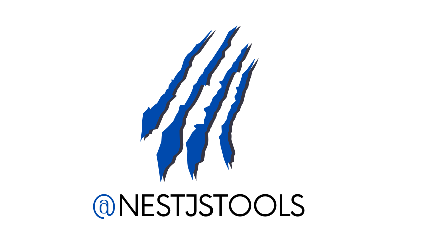

<p align="center">
  
</p>

# NestJS MQTT Messaging Extension – Event-Driven Transport for Distributed Systems

A production-ready MQTT transport adapter for the **NestJSTools Messaging Library**, enabling lightweight, event-driven communication between NestJS applications, devices, and services.

This extension allows you to use **MQTT** as a messaging channel inside the NestJSTools Messaging ecosystem, with support for message buses, routing keys, handlers, consumers, MQTT 3.1/3.1.1, and MQTT 5.

Designed for:

* IoT devices and edge services
* Event-driven NestJS systems
* Telemetry and device-status events
* Cross-language messaging
* MQTT brokers deployed in the cloud or on-premises

---

## Documentation

* https://docs.nestjstools.com/messaging
* https://nestjstools.com

---

## Installation

You need a reachable MQTT broker. The examples below use Mosquitto (or another broker) at `mqtt://localhost:1883`.

```bash
npm install @nestjstools/messaging @nestjstools/messaging-mqtt-extension
```

or

```bash
yarn add @nestjstools/messaging @nestjstools/messaging-mqtt-extension
```

## MQTT Integration: Messaging Configuration Example

---

### Simple config for MQTT messaging

The configuration below creates a bus named `mqtt-message.bus`. It publishes through `mqtt-events` and consumes all MQTT topics beginning with `orders/`.

```typescript
import { Module } from '@nestjs/common';
import { MessagingModule } from '@nestjstools/messaging';
import {
  MessagingMqttExtensionModule,
  MqttChannelConfig,
} from '@nestjstools/messaging-mqtt-extension';

@Module({
  imports: [
    MessagingMqttExtensionModule, // Enables the MQTT transport.
    MessagingModule.forRoot({
      buses: [
        {
          name: 'mqtt-message.bus',
          channels: ['mqtt-events'],
        },
      ],
      channels: [
        new MqttChannelConfig({
          name: 'mqtt-events',
          brokerUrl: 'mqtt://localhost:1883',
          clientId: 'orders-service', // Must be unique per running client.
          enableConsumer: true,
          defaultQos: 1,
          subscriptions: [{ topicFilter: 'orders/#' }],
        }),
      ],
      debug: true, // Optional: enable Messaging debug logs.
    }),
  ],
})
export class AppModule {}
```

Use one configuration in a publisher service and the same subscription configuration in a separate consumer service. A single application may also publish and consume, as in this example.

## Dispatch messages via bus (example)

```typescript
import { Injectable } from '@nestjs/common';
import {
  IMessageBus,
  MessageBus,
  RoutingMessage,
} from '@nestjstools/messaging';

@Injectable()
export class OrdersService {
  constructor(
    @MessageBus('mqtt-message.bus') private readonly messageBus: IMessageBus,
  ) {}

  async createOrder(): Promise<void> {
    await this.messageBus.dispatch(
      new RoutingMessage({ orderId: '123' }, 'orders/created'),
    );
  }
}
```

Without MQTT-specific options, `orders/created` is both the messaging routing key and the MQTT publish topic.

### Handler for your message

```typescript
import { IMessageHandler, MessageHandler } from '@nestjstools/messaging';

@MessageHandler('orders/created')
export class OrderCreatedHandler
  implements IMessageHandler<{ orderId: string }>
{
  async handle(message: { orderId: string }): Promise<void> {
    console.log(`Created order: ${message.orderId}`);
  }
}
```

Register the handler as a provider in its Nest module. An application subscribed to `orders/#` receives the MQTT message and dispatches it to this handler.

## 📨 Communicating Beyond a NestJS Application (Cross-Language Messaging)

The adapter can receive messages from any MQTT client, not only NestJS applications.

1. **Publish to a subscribed MQTT topic.** For example, publish to `devices/device-17/status` when the NestJS channel subscribes to `devices/+/status`.

2. **Choose the handler routing key.** With an ordinary MQTT JSON payload or string payload, the concrete received topic is used as the routing key. The example topic above is dispatched to:

   ```typescript
   @MessageHandler('devices/device-17/status')
   ```

   To send every matching topic to one handler instead, set `routingKey` in the subscription:

   ```typescript
   subscriptions: [
     { topicFilter: 'devices/+/status', routingKey: 'device.status' },
   ];

   @MessageHandler('device.status')
   export class DeviceStatusHandler {}
   ```

3. **Publish JSON or text.** JSON objects are dispatched as objects; non-JSON payloads are dispatched as strings.

---

## Routing Strategy

The MQTT **topic** controls which MQTT clients receive a message. The NestJSTools **routing key** controls which `@MessageHandler` runs.

* **Default routing:** If no `MqttMessageOptions` are supplied, the routing key is used as the MQTT publish topic. For example, `new RoutingMessage(payload, 'orders/created')` publishes to `orders/created`.

* **Separate topic and routing key:** The extension publishes an envelope containing the original routing key. This lets several logical message types share an MQTT topic while still using separate handlers.

```typescript
import { RoutingMessage } from '@nestjstools/messaging';
import { MqttMessageOptions } from '@nestjstools/messaging-mqtt-extension';

await this.messageBus.dispatch(
  new RoutingMessage(
    { orderId: '123' },
    'order.created', // Selects @MessageHandler('order.created').
    new MqttMessageOptions({ topic: 'orders/events', qos: 1 }),
  ),
);
```

In this case the broker publishes to `orders/events`, but the receiving NestJS application dispatches the message to `@MessageHandler('order.created')`.

* **Wildcard subscriptions:** A subscription such as `devices/+/status` receives all matching topics. For extension-published messages, the envelope's routing key is retained. For ordinary MQTT messages, the concrete topic becomes the routing key unless the subscription sets a fixed `routingKey`.

---

## Configuration Options

### MqttChannelConfig

```typescript
new MqttChannelConfig({
  name: 'mqtt-events',
  brokerUrl: 'mqtts://broker.example.com:8883',
  clientId: 'orders-service',
  username: 'orders',
  password: 'secret',
  protocolVersion: 5,
  clean: false,
  sessionExpiryInterval: 3600,
  defaultQos: 1,
  subscriptions: [{ topicFilter: 'orders/#', qos: 1 }],
  // ca, cert, key, and rejectUnauthorized are also supported for TLS.
});
```

| **Property** | **Description** | **Default Value** |
| --- | --- | --- |
| **`name`** | Messaging channel name. | Required |
| **`brokerUrl`** | Broker URL using `mqtt`, `mqtts`, `ws`, or `wss`. | Required |
| **`clientId`** | MQTT client identifier; use a unique value for every running client. | MQTT.js default |
| **`username`, `password`** | Optional broker credentials. | |
| **`protocolVersion`** | MQTT version: `3`, `4`, or `5`. | `4` |
| **`clean`** | Start a clean MQTT session. | `true` |
| **`keepalive`** | Keepalive interval, in seconds. | `60` |
| **`reconnectPeriod`** | Delay between reconnect attempts, in milliseconds. | `1000` |
| **`sessionExpiryInterval`** | MQTT 5 session expiry interval. | |
| **`subscriptions`** | Topic filters consumed by this channel. | `[]` |
| **`defaultQos`** | Default QoS for publishing and subscriptions. | `0` |
| **`enableConsumer`** | Enable subscriptions and handler dispatch. | `true` |
| **`ca`, `cert`, `key`, `rejectUnauthorized`** | TLS configuration for `mqtts` and `wss`. | |

### MqttMessageOptions

Use per-message options to override the topic or channel QoS, retain messages, and set MQTT 5 publish properties:

```typescript
new MqttMessageOptions({
  topic: 'orders/events',
  qos: 1,
  retain: false,
  properties: {
    responseTopic: 'orders/replies',
    messageExpiryInterval: 60,
  },
});
```

| **Property** | **Description** |
| --- | --- |
| **`topic`** | Overrides the MQTT publish topic. |
| **`qos`** | Overrides the channel default QoS. |
| **`retain`** | Retains the message at the broker. |
| **`dup`** | Sets the MQTT duplicate-delivery flag. |
| **`properties`** | MQTT 5 publish properties, such as response topic, correlation data, and message expiry. |

---

## Delivery behavior

| QoS | Delivery behavior |
| --- | --- |
| `0` | At-most-once delivery. |
| `1` | At-least-once delivery; handlers must tolerate duplicates. |
| `2` | Exactly once between MQTT client and broker; handlers must still tolerate repeats after application failures. |

MQTT acknowledges a packet before the NestJS handler finishes. A handler failure cannot make the broker retry or dead-letter the packet. Keep handlers idempotent and implement application-level retry or dead-letter handling when required.

---

> **Note:** MQTT brokers differ in authentication, TLS, retained-message, and session configuration. If this configuration does not fit your use case, create a custom channel by extending the library's channel abstractions.
